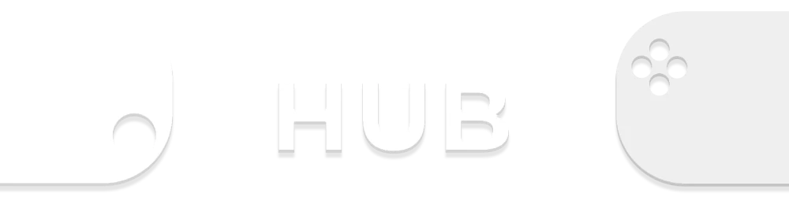
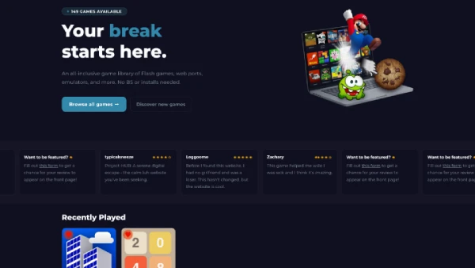
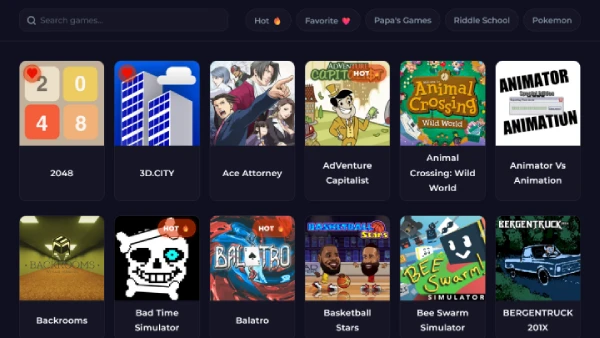
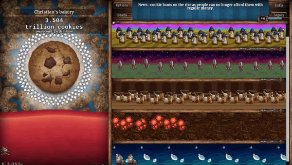
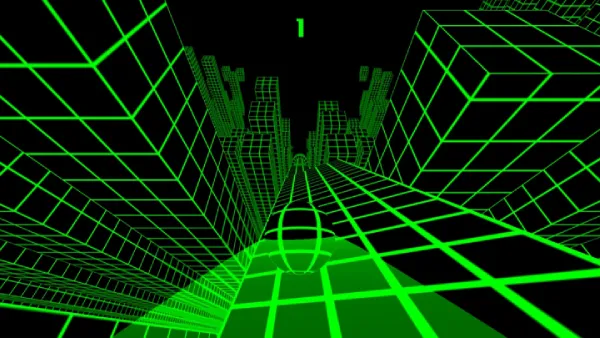

    

    
    
    
    

# Screenshots 📷

    
    

    
    

# Features 🔧

- Extensive Library of Unblocked Games
- Supports Multiple Emulators
    - Flash
    - Nintendo DS
    - Nintendo 64
    - Gameboy Advance Color
    - And many more!
- Quality-of-Life
    - See Recently Played
    - Save Favorite Games
    - Useful Search Filters
    - Light/Dark Themes
- Tab Cloaking
    - Six Presets
    - Custom Tab Icon & Title
    - Custom Presets
- Panic Button
    - Quickly Tap `esc`
    - Custom Endpoint

# Contributing ✏️

Contributions are welcome! If you have any bug reports, feature requests, or suggestions, please open an issue or submit a pull request.

To request a game, head over to [this Google Form](https://forms.gle/FuhUKVByGVhnG1ME9), and fill out all of the requested information.

If you'd like to potentially appear on the front page, head over to [this Google Form](https://forms.gle/xAx89Uk5XyQ7FQLj8), and fill out all of the requested information.

If you have an inquiry to talk to me directly regarding Project-HUB, please send an e-mail over at [project.hub.games@gmail.com](mailto:project.hub.games@gmail.com). I do my best to respond to all messages, but please keep in mind that this is a passion project of mine, and not my full-time job.

# Acknowledgements 🌟

Each game I curate can be found and seen in the [assets repo available here](https://github.com/IamChristianS/assets). It also contains credits for any projects or things I think deserved crediting.

I'd also like to give some special thanks to [3kh0](https://github.com/3kh0), who is kind of _the_ guy in the unblocked gaming world. If it wasn't for his projects, and the projects that have been started because of him, this likely wouldn't exist.

---

**Important Note**: This site should not be used in school or workplace environments where it is disallowed. By using this site, you agree that you are in a location that allows its usage, and any discretion is up to the user.
